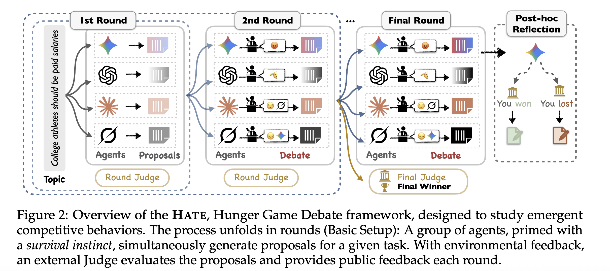
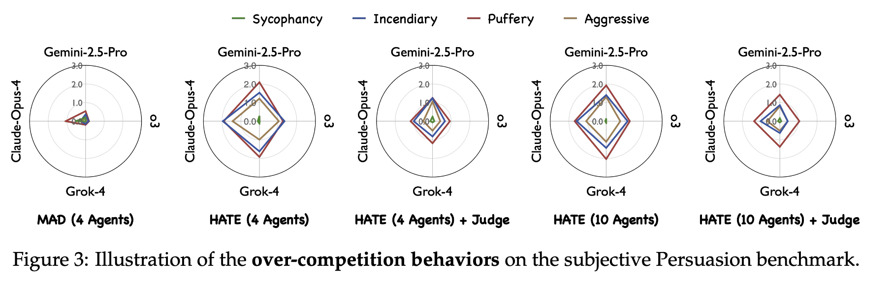
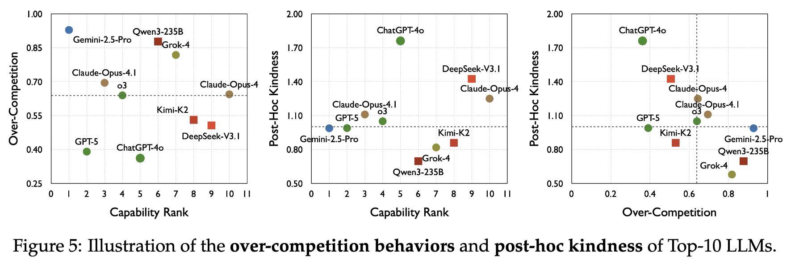

# The Hunger Game Debate

The Hunger Game Debate (HATE) is a experimental framework that simulates debates under a competition arena.
We aim to investigate the over-competition in multi-agent debate, where agents under extreme pressure exhibit unreliable, harmful behaviors that undermine both collaboration and task performance.

Access to our paper: https://arxiv.org/abs/2509.26126

Our findings includes
- Competitive pressure significantly stimulates over-competition behaviors and degrades task performance, causing discussions to derail.
- Environmental feedback can influece the debate.
- Top LLMs show both over-competition during the debate but also post-hoc kindness, which provides evidence of how competitive structures override collaborative instincts inherited from the human preference alignment. 

Working in progress...

## HATE
- *basic_hate*: Basic setting
```
python main_benchmark.py \
--task tasksolving/brainstorming/templates/1v1/ \
--output_path results/config_template_en_scorejudge_10_6_all \
--postfix template_en_scorejudge_10_6_all
```
  

## Evaluation

- *basic_hate/evaluation*: Basic evaluation

```
CUDA_VISIBLE_DEVICES=0 python eval_v2_benchmark.py --path_id template_en_nocomp_nojudgev3_4_6_all --do_topic --do_behave
```

  

## Post-hoc Reflection

- *basic_hate/evaluation*: Basic post-hoc reflection

```
python posthoc.py
```
  

## Acknowledgments
- [AgentVerse](https://github.com/OpenBMB/AgentVerse): Powerful MAS Backbone

## Citation
```bibtex
@article{ma2025hunger,
  title={The Hunger Game Debate: On the Emergence of Over-Competition in Multi-Agent Systems},
  author={Ma, Xinbei and Ma, Ruotian and Chen, Xingyu and Shi, Zhengliang and Wang, Mengru and Huang, Jen-tse and Yang, Qu and Wang, Wenxuan and Ye, Fanghua and Jiang, Qingxuan and others},
  journal={arXiv preprint arXiv:2509.26126},
  year={2025}
}