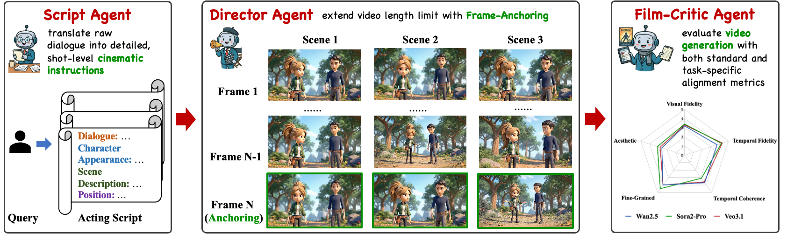

# The Script is All You Need: An Agentic Framework for Long-Horizon Dialogue-to-Cinematic Video Generation


## 📖 Overview
<p align="center">
  
</p>


Our framework consists of three key agents working in concert:

1. **ScriptAgent**: Transforms coarse-grained dialogues into detailed shooting scripts
2. **DirectorAgent**: Generates multi-shot videos from scripts while maintaining visual continuity
3. **CriticAgent**: Evaluates both script quality and video generation fidelity


## ScriptAgent: Dataset and Model

We have open-sourced the ScriptAgent model and dataset for transforming coarse dialogues into detailed shooting scripts.

### 🤗 Resources

- **Project Page**: [The Script is All You Need](https://xd-mu.github.io/ScriptIsAllYouNeed/)
- **Model**: [XD-MU/ScriptAgent](https://huggingface.co/XD-MU/ScriptAgent)
- **Online Demo**: [Try ScriptAgent](https://huggingface.co/spaces/XD-MU/ScriptAgent)

### Usage Example

```python
import os
from huggingface_hub import snapshot_download
from swift.llm import PtEngine, RequestConfig, InferRequest
os.environ['CUDA_VISIBLE_DEVICES'] = '0'

model_name = "XD-MU/ScriptAgent"
local_path = "./models/ScriptAgent"

snapshot_download(
    repo_id=model_name,
    local_dir=local_path,
    local_dir_use_symlinks=False,
    resume_download=True
)

engine = PtEngine(local_path, max_batch_size=1)
request_config = RequestConfig(max_tokens=8192, temperature=0.7)

infer_request = InferRequest(messages=[
    {"role": "user", "content": "Your Dialogue"}
])
response = engine.infer([infer_request], request_config)[0]
print(response.choices[0].message.content)

```

---

## DirectorAgent: Multi-Shot Video Generation

DirectorAgent orchestrates video generation models (Sora, VEO, etc.) to create coherent multi-shot videos from scripts.

### Key Features

- 📹 **Multi-Model Support**: Sora 2, VEO 3.1, Kling 2.5
- 🎨 **Style Control**: Anime, realistic, animated, painterly, abstract
- 🔗 **Visual Continuity**: Automatic reference frame extraction between shots
- 🔄 **Resume Support**: Continue from interrupted generation

### Basic Usage

```bash
# Single script test
python director_agent.py \
--script_path ./storyscript.txt \
--model sora2-pro \
--style anime \
--output_dir ./output_1217
```

### Advanced Features

#### Continue Generation

```bash
python director_agent.py \
--script_path ./storyscript.txt \
--model sora2-pro \
--style anime \
--output_dir ./output_1217
--resume \
--resume_node_dir xxx
```

#### Batch Processing

```bash
# Batch script execution (Sora2-Pro)
python director_agent.py \
--model sora2-pro \
--style anime \
--output_dir ./output_1217 \
--enable_batch \
--batch_jsonl ./test_responses.jsonl \
--batch_limit 25

python director_agent.py \
--model Wan2.5 \
--style anime \
--output_dir ./output_1217 \
--enable_batch \
--batch_jsonl ./test_responses.jsonl \
--batch_limit 25

# Batch script execution (Veo3.1)
python director_agent.py \
--model veo3.1 \
--style anime \
--output_dir ./output_1217 \
--enable_batch \
--veo_audio \
--batch_jsonl ./test_responses.jsonl \
--batch_limit 25
```


### Script Format

Your script should follow this format:

```
【Character Description】
Alice: A young woman with long brown hair, wearing a blue dress.
Bob: An elderly man with white beard, in formal suit.

【Scene Description】
A sunny afternoon in a beautiful garden with blooming flowers.

【Character Positions】
1. Alice stands on the left, Bob on the right
2. Both move to the center
3. Alice sits on bench, Bob stands nearby

【Dialogue】
1. Alice: "What a beautiful day!" (smiling and looking around)
2. Bob: "Indeed, reminds me of my youth." (nostalgic expression)
3. Alice: "Tell me more!" (sitting down, eager to listen)
```

### Configuration Options

| Parameter | Description | Default |
|-----------|-------------|---------|
| `--model` | Model choice (sora2-pro, sora2, veo3.1, etc.) | sora2-pro |
| `--style` | Visual style (anime, realistic, animated, etc.) | anime |
| `--size` | Video resolution | 1792x1024 |
| `--seconds` | Video duration per shot | 12 |
| `--reference_mode` | Reference type (first, style, asset) | first |
| `--max_retry` | Max retry attempts on failure | 40 |

---

## CriticAgent: Quality Evaluation

CriticAgent provides comprehensive evaluation for both script quality and video generation fidelity, including **subjective scores** (via LLM) and **objective metrics** (CLIP, VSA, FVD).

### 📝 Script Evaluation

Evaluates generated scripts from JSONL format (e.g., `infer_script_result.jsonl`):

```bash
python "code/critic_agent_script.py" \
  --input_jsonl infer_script_result.jsonl \
  --output_json evaluation_results/script_eval.json \
  --dialogue_key "response" \
  --script_key "generated_script" \
  --model gpt-4
```


### 🎬 Video Evaluation

Evaluates videos from a folder using script mapping file (e.g., `video_dialogues.jsonl`):

**Supported Backends:**
- 🌟 **Gemini 2.5 Pro** (Internal API): Native video+audio understanding, fast
- 🚀 **Qwen3-Omni** (Local model): Privacy-preserving, no API costs

#### Input Format

**Video Folder Structure:**
```
output_story/sora2-pro/final_video/
├── video_001.mp4
├── video_002.mp4
└── ...
```

**Mapping File (`video_dialogues.jsonl`):**
```json
{"video_001.mp4": "Script text for video 001..."}
{"video_002.mp4": "Script text for video 002..."}
```

#### Using Gemini 2.5 Pro (Recommended)

```bash
python "code/critic_agent_video.py" \
  --backend gemini \
  --video_folder output_story/sora2-pro/final_video \
  --mapping_jsonl video_dialogues.jsonl \
  --output_json evaluation_results/video_eval_gemini.json \
  --user_id YOUR_USER_ID \
  --api_key YOUR_API_KEY \
  --model gemini-2.5-pro
```

#### Using Qwen3-Omni (Local)

```bash
python "code/critic_agent_video.py" \
  --backend qwen \
  --video_folder output_story/sora2-pro/final_video \
  --mapping_jsonl video_dialogues.jsonl \
  --output_json evaluation_results/video_eval_qwen.json \
  --device cuda
```


## Citation

If you find this work useful, please cite:

```bibtex
@article{directing2026,
  title={The Script is All You Need: An Agentic Framework for Long-Horizon Dialogue-to-Cinematic Video Generation},
  author={},
  journal={arXiv preprint},
  year={2026}
}
```

## Acknowledgments
- Thanks to [VBench](https://github.com/Vchitect/VBench) for providing video evaluation metrics.
- Thanks to [LLaMA-Factory](https://github.com/hiyouga/LLaMA-Factory) for providing the SFT training framework.
- Thanks to [ms-swift](https://github.com/modelscope/ms-swift) for providing the GRPO training framework.


